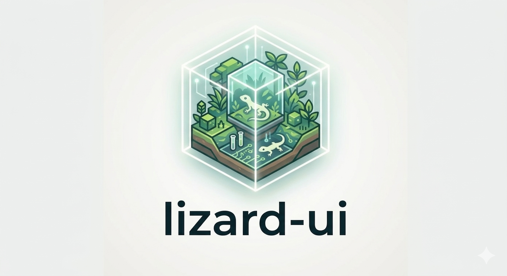

<p align="center">
  
</p>

# Lizard UI

[](https://www.npmjs.com/package/lizard-ui)
[](https://opensource.org/licenses/MIT)
[](https://www.typescriptlang.org/)
[](https://github.com/lizard-ui/lizard-ui/actions/workflows/deploy.yml)

**Lizard UI** is a React component library with shadcn-style primitives and Tailwind-native glass styling — gradients, blur, and saturation driven by theme CSS variables, no extra runtime.

---

## Install

```bash
npm install lizard-ui
# bun add lizard-ui  |  pnpm add lizard-ui
```

## Quick start

```ts
// 1. Import the theme stylesheet once
import 'lizard-ui/styles/themes.css';
```

```tsx
// 2. Wrap your app
import { ThemeProvider } from 'lizard-ui';

export default function Root() {
  return <ThemeProvider><App /></ThemeProvider>;
}
```

```tsx
// 3. Use components
import { Button, Card, CardContent } from 'lizard-ui';

<Card variant="glassPrimary">
  <CardContent>
    <Button variant="glassSecondary">Action</Button>
  </CardContent>
</Card>
```

---

## Features

- **23 color themes** — swap palettes at runtime via `data-theme` on `<html>`
- **Light / dark / system** — `ThemeProvider` + `useTheme` hook, persisted to `localStorage`
- **Glass variants** — `Card` and `Button` glass surfaces tinted by theme `primary` / `secondary` tokens
- **Standalone glass utilities** — import individual glass class functions for custom components
- **Modular types** — one TypeScript file per component in `src/types/`
- **Tailwind-safe LIST_MAPs** — all class strings statically present; no dynamic class generation
- **Tree-shakeable** — ESM + CJS, TypeScript declarations

---

## Documentation

Full reference in [`docs/`](./docs/README.md):

| | |
|---|---|
| [Types](./docs/types/README.md) | Variant unions, component props, theme types |
| [Utils](./docs/utils/README.md) | `cn`, token parser, variant MAP constructors, glass functions |
| [Components](./docs/components/ui/README.md) | `Button`, `Card`, `Badge`, `BackgroundPattern`, layout |
| [Contexts](./docs/contexts/README.md) | `ThemeProvider`, `useTheme` |
| [Styles](./docs/styles/README.md) | Theme tokens, dark mode, custom themes, Tailwind config |
| [Examples](./docs/examples/README.md) | Copy-paste snippets |

---

## Dev scripts

| Script | Description |
|---|---|
| `bun dev` | Vite playground at `localhost:5173` |
| `bun run build` | Rollup → `dist/` (ESM + CJS + types + CSS) |
| `bun run build:site` | Vite static build → `playground-dist/` |
| `bun run test` | Jest |
| `bun run lint` | ESLint |
| `bun run typecheck` | `tsc --noEmit` |

---

## Contributing

Fork → branch → PR. See [`CONTRIBUTING.md`](CONTRIBUTING.md).

## License

MIT — see [`LICENSE`](LICENSE).

---

Made by [xarlizard](https://www.github.com/xarlizard)
